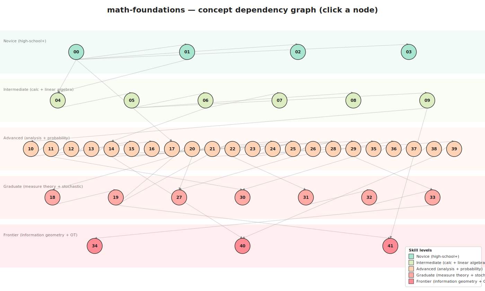

# math-foundations

> A canonical mathematical foundations graph — 42 concepts spanning sets through optimal transport — used as the shared substrate for the [`study-paper`](https://github.com/pleyva2004/claude-skill-study-paper) Claude Code skill's per-study learning maps.

## 🌐 Interactive views

| View | URL | Best for |
|------|-----|----------|
| 🔵 **D3 force graph** — drag, zoom, filter | [`pleyva2004.github.io/math-foundations/html/`](https://pleyva2004.github.io/math-foundations/html/) | Exploring relationships visually |
| 🗺️ **Clickable SVG dependency graph** | [`pleyva2004.github.io/math-foundations/html/graph.svg`](https://pleyva2004.github.io/math-foundations/html/graph.svg) | Click any node → jump to that concept |
| 📓 **Aggregate Jupyter notebook** | [`notebook/foundations.ipynb`](notebook/foundations.ipynb) | Cell-by-cell linked index |

> **Note:** the live URLs above are served by GitHub Pages. If they don't work, enable Pages: *Settings → Pages → Source: Deploy from a branch → main → /(root) → Save*.

## The dependency graph

[](https://pleyva2004.github.io/math-foundations/html/graph.svg)

*Click the image above → opens the live SVG where each node is a working link to its concept folder.*

## 📖 Notation glossary

Every distinct mathematical symbol used across the 42 concept lessons is indexed in a single auto-generated glossary — the canonical "what does this symbol mean and where does it first appear?" lookup:

- 📑 **Markdown (browse on GitHub):** [`NOTATION.md`](NOTATION.md)
- 📄 **PDF cheatsheet (CI-compiled):** [`notation.pdf`](notation.pdf) — source: [`notation.tex`](notation.tex)
- 🧩 **Single source of truth (machine-readable):** [`notation.json`](notation.json)

Regenerate after editing `notation.json`:

```bash
python generate_notation.py
```

## Each concept ships four artifacts

Every concept lives in `concepts/<NN>-<slug>/`:
1. `README.md` — plain-English intro + LaTeX math + cross-links.
2. `lesson.tex` → `lesson.pdf` (CI-rendered) — standalone formal exposition with theorem + proof.
3. `code.py` — runnable demonstration (<30 s on CPU; finite/discrete witness for abstract concepts).
4. `notebook.ipynb` — interactive Jupyter form, runnable in Colab.

## Pick your entry point

| Order | Level | Audience |
|-------|-------|----------|
| 0 | `novice` | Novice (high-school+) |
| 1 | `intermediate` | Intermediate (calc + linear algebra) |
| 2 | `advanced` | Advanced (analysis + probability) |
| 3 | `graduate` | Graduate (measure theory + stochastic) |
| 4 | `frontier` | Frontier (information geometry + OT) |

### Curated tours

| Tour | Audience | File |
|------|----------|------|
| Novice | "I don't know what a function is" | [`tours/novice.md`](tours/novice.md) |
| CS undergrad | "I know calc, want probability" | [`tours/cs-undergrad.md`](tours/cs-undergrad.md) |
| Math grad | "I know measure theory" | [`tours/math-grad.md`](tours/math-grad.md) |
| Researcher | "Skip to a paper's foundations" | [`tours/researcher.md`](tours/researcher.md) |


## Concept index (clickable)

The full 42-concept list, by level. Every entry below is a working markdown link.

### Novice (high-school+)

- **00** [Sets and Functions](concepts/00-sets-and-functions/README.md) — The two foundational objects: collections and rules that map elements between them.
- **01** [Logic and Proof](concepts/01-logic-and-proof/README.md) — Propositional and predicate logic, truth tables, the basic proof strategies (direct, contrapositive, contradiction, induction).
- **02** [Counting and Combinatorics](concepts/02-counting/README.md) — Counting principles: permutations, combinations, the pigeonhole principle, inclusion-exclusion.
- **03** [Relations and Orderings](concepts/03-relations-and-orderings/README.md) — Equivalence relations, partial and total orders, equivalence classes.

### Intermediate (calc + linear algebra)

- **04** [Groups, Rings, Fields](concepts/04-groups-rings-fields/README.md) — Abstract algebraic structures with binary operations satisfying axioms.
- **05** [Vector Spaces](concepts/05-vector-spaces/README.md) — Sets closed under linear combinations over a field; the universal object of linear algebra.
- **06** [Linear Maps and Matrices](concepts/06-linear-maps/README.md) — Structure-preserving functions between vector spaces; the matrix representation.
- **07** [Eigenvalues and Eigenvectors](concepts/07-eigenvalues/README.md) — Directions preserved by a linear map up to scaling; the building blocks of spectral analysis.
- **08** [Inner Product Spaces](concepts/08-inner-product-spaces/README.md) — Vector spaces equipped with a notion of angle and length via an inner product.
- **09** [Norms and Metrics](concepts/09-norms-and-metrics/README.md) — Generalised notions of distance; the foundation of analysis on vector spaces.

### Advanced (analysis + probability)

- **10** [Sequences and Limits](concepts/10-sequences-and-limits/README.md) — Convergence of sequences; the epsilon-N definition; Cauchy sequences and completeness.
- **11** [Continuity](concepts/11-continuity/README.md) — The epsilon-delta definition; continuity as preservation of limits; uniform vs pointwise continuity.
- **12** [Derivatives (Univariate)](concepts/12-derivatives/README.md) — The local linear approximation; the limit of a difference quotient; differentiation rules.
- **13** [Multivariate Calculus](concepts/13-multivariate-calculus/README.md) — Partial derivatives; the chain rule in multiple variables; directional derivatives.
- **14** [Gradient and Jacobian](concepts/14-gradient-jacobian/README.md) — The gradient as the vector of partial derivatives; the Jacobian as the matrix of partial derivatives of a vector-valued function.
- **15** [Integration (Riemann)](concepts/15-integration/README.md) — The Riemann integral as a limit of step-function approximations; the fundamental theorem of calculus.
- **16** [Series and Convergence](concepts/16-series-and-convergence/README.md) — Convergence of infinite sums; absolute vs conditional; power series and Taylor expansions.
- **17** [Sample Spaces](concepts/17-sample-spaces/README.md) — The set of all possible outcomes of an experiment; the starting point of probability.
- **20** [Conditional Probability](concepts/20-conditional-probability/README.md) — P(A | B) = P(A and B) / P(B); the update rule for new information.
- **21** [Independence](concepts/21-independence/README.md) — P(A and B) = P(A) P(B); events that do not influence each other.
- **22** [Random Variables](concepts/22-random-variables/README.md) — Measurable functions from the sample space to the real line; the bridge from sets-of-outcomes to numerical values.
- **23** [Probability Distributions](concepts/23-distributions/README.md) — The full description of a random variable: its cumulative distribution function, its discrete probability mass function, or its continuous probability density function.
- **24** [Probability Density Functions](concepts/24-pdf/README.md) — A non-negative integrable function whose integral over a set gives the probability that a continuous random variable lands in that set.
- **25** [Expectation](concepts/25-expectation/README.md) — The weighted average of a random variable's values, weighted by their probability; the integral of the random variable against its distribution.
- **26** [Variance and Covariance](concepts/26-variance-covariance/README.md) — Second-order moments measuring spread (variance) and linear association (covariance).
- **28** [Change of Variables (Probability)](concepts/28-change-of-variables-probability/README.md) — How densities transform under invertible smooth maps; the Jacobian determinant appears as the volume-correction factor.
- **29** [Ordinary Differential Equations](concepts/29-ode/README.md) — Equations relating a function to its derivatives; the basic objects of dynamical systems.
- **35** [Self-Information (Surprisal)](concepts/35-self-information/README.md) — I(x) = -log p(x); the surprise associated with observing an outcome under a probability distribution.
- **36** [Shannon Entropy](concepts/36-shannon-entropy/README.md) — H(X) = E[-log p(X)]; the average information content of a random variable; measures uncertainty.
- **37** [Cross-Entropy](concepts/37-cross-entropy/README.md) — H(p, q) = -E_p[log q]; the average code-length when using distribution q to encode samples drawn from p.
- **38** [KL Divergence](concepts/38-kl-divergence/README.md) — D_KL(p || q) = E_p[log p - log q]; the relative entropy / information gain in moving from q to p. Non-symmetric, non-metric.
- **39** [Mutual Information](concepts/39-mutual-information/README.md) — I(X; Y) = D_KL(p(x,y) || p(x) p(y)); the reduction in uncertainty about X from observing Y.

### Graduate (measure theory + stochastic)

- **18** [Events and Sigma-Algebras](concepts/18-sigma-algebras/README.md) — A sigma-algebra is a collection of subsets closed under complement and countable union; the rigorous basis for which events can be assigned probabilities.
- **19** [Probability Measures](concepts/19-probability-measures/README.md) — A function from a sigma-algebra to [0,1] satisfying countable additivity and P(Omega) = 1.
- **27** [Conditional Expectation](concepts/27-conditional-expectation/README.md) — The expected value of a random variable given the value of another (or given a sub-sigma-algebra); the foundation of regression and martingale theory.
- **30** [Existence and Uniqueness (Picard-Lindelöf)](concepts/30-existence-uniqueness/README.md) — Sufficient conditions (Lipschitz) under which an ODE has a unique solution; the foundation of well-posed dynamical systems.
- **31** [Stochastic Processes](concepts/31-stochastic-processes/README.md) — Indexed families of random variables; the time-evolution of randomness.
- **32** [Brownian Motion / Wiener Process](concepts/32-brownian-motion/README.md) — The canonical continuous-time stochastic process with independent Gaussian increments; the building block of stochastic calculus.
- **33** [Stochastic Differential Equations](concepts/33-sde/README.md) — Differential equations driven by Brownian motion; the continuous-time analogue of random walks.

### Frontier (information geometry + OT)

- **34** [Itô Calculus](concepts/34-ito-calculus/README.md) — The calculus of stochastic integrals where the integrator is non-smooth (Brownian); Itô's lemma replaces the chain rule.
- **40** [Information Geometry (Fisher Metric)](concepts/40-information-geometry/README.md) — Treats probability distributions as points on a Riemannian manifold; the Fisher information matrix as the natural metric tensor.
- **41** [Optimal Transport (Wasserstein)](concepts/41-optimal-transport/README.md) — Wasserstein distance W_p(mu, nu) = inf over couplings of E[|X - Y|^p]^(1/p); the cost of optimally moving one distribution to another. Provides a meaningful metric on distributions even when they have disjoint supports.

## How the graph evolves

When the [`study-paper`](https://github.com/pleyva2004/claude-skill-study-paper) skill encounters a paper whose math deep dive defines a concept not yet in this graph, Stage 7 of the skill adds it here. This repo is the durable shared substrate.

## Regenerating views from `manifest.json`

```bash
python generate.py            # refresh README, html/data.json, aggregate notebook
python generate_svg.py        # refresh html/graph.svg
python generate_notation.py   # refresh NOTATION.md and notation.tex from notation.json
python validate_bodies.py     # quality-gate the 42 concept folders
```

## License

MIT.
