# math-foundations

> A canonical mathematical foundations graph used as the shared substrate for the [`study-paper`](https://github.com/pleyva2004/claude-skill-study-paper) Claude Code skill's per-study learning maps.

Each concept lives in `concepts/<NN>-<slug>/` and ships **four artifacts**:
1. `README.md` — plain-English intro + LaTeX math + cross-links (GitHub-renderable).
2. `lesson.tex` — standalone-compilable formal LaTeX exposition; CI renders to `lesson.pdf`.
3. `code.py` — runnable demonstration (<30 s on CPU; finite/discrete witness for abstract concepts).
4. `notebook.ipynb` — interactive Jupyter form, runnable cell-by-cell in Colab.

Plus three interactive aggregate views: mermaid (this README), notebook ([`notebook/foundations.ipynb`](notebook/foundations.ipynb), an index), and HTML force graph ([`html/index.html`](html/index.html)).

## Pick your entry point

| Order | Level | Audience | Style |
|-------|-------|----------|-------|
| 0 | `novice` | Novice (high-school+) | Color #a8e6cf |
| 1 | `intermediate` | Intermediate (calc + linear algebra) | Color #dcedc1 |
| 2 | `advanced` | Advanced (analysis + probability) | Color #ffd3b6 |
| 3 | `graduate` | Graduate (measure theory + stochastic) | Color #ffaaa5 |
| 4 | `frontier` | Frontier (information geometry + OT) | Color #ff8b94 |

### Curated tours

| Tour | Audience | File |
|------|----------|------|
| Novice | "I don't know what a function is" | [`tours/novice.md`](tours/novice.md) |
| CS undergrad | "I know calc, want probability" | [`tours/cs-undergrad.md`](tours/cs-undergrad.md) |
| Math grad | "I know measure theory" | [`tours/math-grad.md`](tours/math-grad.md) |
| Researcher | "Skip to a paper's foundations" | [`tours/researcher.md`](tours/researcher.md) |

## The graph

```mermaid
graph TD
  classDef novice fill:#a8e6cf,stroke:#333,stroke-width:1px;
  classDef intermediate fill:#dcedc1,stroke:#333,stroke-width:1px;
  classDef advanced fill:#ffd3b6,stroke:#333,stroke-width:1px;
  classDef graduate fill:#ffaaa5,stroke:#333,stroke-width:1px;
  classDef frontier fill:#ff8b94,stroke:#333,stroke-width:1px;
  00["00: Sets and Functions"]
  01["01: Logic and Proof"]
  02["02: Counting and Combinatorics"]
  03["03: Relations and Orderings"]
  04["04: Groups, Rings, Fields"]
  05["05: Vector Spaces"]
  06["06: Linear Maps and Matrices"]
  07["07: Eigenvalues and Eigenvectors"]
  08["08: Inner Product Spaces"]
  09["09: Norms and Metrics"]
  10["10: Sequences and Limits"]
  11["11: Continuity"]
  12["12: Derivatives (Univariate)"]
  13["13: Multivariate Calculus"]
  14["14: Gradient and Jacobian"]
  15["15: Integration (Riemann)"]
  16["16: Series and Convergence"]
  17["17: Sample Spaces"]
  18["18: Events and Sigma-Algebras"]
  19["19: Probability Measures"]
  20["20: Conditional Probability"]
  21["21: Independence"]
  22["22: Random Variables"]
  23["23: Probability Distributions"]
  24["24: Probability Density Functions"]
  25["25: Expectation"]
  26["26: Variance and Covariance"]
  27["27: Conditional Expectation"]
  28["28: Change of Variables (Probability)"]
  29["29: Ordinary Differential Equations"]
  30["30: Existence and Uniqueness (Picard-Lindelöf)"]
  31["31: Stochastic Processes"]
  32["32: Brownian Motion / Wiener Process"]
  33["33: Stochastic Differential Equations"]
  34["34: Itô Calculus"]
  35["35: Self-Information (Surprisal)"]
  36["36: Shannon Entropy"]
  37["37: Cross-Entropy"]
  38["38: KL Divergence"]
  39["39: Mutual Information"]
  40["40: Information Geometry (Fisher Metric)"]
  41["41: Optimal Transport (Wasserstein)"]
  00 --> 01
  00 --> 02
  00 --> 03
  00 --> 04
  01 --> 04
  04 --> 05
  05 --> 06
  06 --> 07
  05 --> 08
  05 --> 09
  09 --> 10
  10 --> 11
  11 --> 12
  12 --> 13
  13 --> 14
  06 --> 14
  11 --> 15
  10 --> 16
  00 --> 17
  17 --> 18
  18 --> 19
  19 --> 20
  20 --> 21
  19 --> 22
  22 --> 23
  23 --> 24
  15 --> 24
  23 --> 25
  15 --> 25
  25 --> 26
  25 --> 27
  20 --> 27
  24 --> 28
  14 --> 28
  12 --> 29
  29 --> 30
  11 --> 30
  22 --> 31
  31 --> 32
  29 --> 33
  32 --> 33
  33 --> 34
  23 --> 35
  35 --> 36
  25 --> 36
  36 --> 37
  37 --> 38
  38 --> 39
  21 --> 39
  38 --> 40
  14 --> 40
  19 --> 41
  09 --> 41
  class 00 novice;
  class 01 novice;
  class 02 novice;
  class 03 novice;
  class 04 intermediate;
  class 05 intermediate;
  class 06 intermediate;
  class 07 intermediate;
  class 08 intermediate;
  class 09 intermediate;
  class 10 advanced;
  class 11 advanced;
  class 12 advanced;
  class 13 advanced;
  class 14 advanced;
  class 15 advanced;
  class 16 advanced;
  class 17 advanced;
  class 18 graduate;
  class 19 graduate;
  class 20 advanced;
  class 21 advanced;
  class 22 advanced;
  class 23 advanced;
  class 24 advanced;
  class 25 advanced;
  class 26 advanced;
  class 27 graduate;
  class 28 advanced;
  class 29 advanced;
  class 30 graduate;
  class 31 graduate;
  class 32 graduate;
  class 33 graduate;
  class 34 frontier;
  class 35 advanced;
  class 36 advanced;
  class 37 advanced;
  class 38 advanced;
  class 39 advanced;
  class 40 frontier;
  class 41 frontier;
  click 00 "concepts/00-sets-and-functions/README.md" "Sets and Functions"
  click 01 "concepts/01-logic-and-proof/README.md" "Logic and Proof"
  click 02 "concepts/02-counting/README.md" "Counting and Combinatorics"
  click 03 "concepts/03-relations-and-orderings/README.md" "Relations and Orderings"
  click 04 "concepts/04-groups-rings-fields/README.md" "Groups, Rings, Fields"
  click 05 "concepts/05-vector-spaces/README.md" "Vector Spaces"
  click 06 "concepts/06-linear-maps/README.md" "Linear Maps and Matrices"
  click 07 "concepts/07-eigenvalues/README.md" "Eigenvalues and Eigenvectors"
  click 08 "concepts/08-inner-product-spaces/README.md" "Inner Product Spaces"
  click 09 "concepts/09-norms-and-metrics/README.md" "Norms and Metrics"
  click 10 "concepts/10-sequences-and-limits/README.md" "Sequences and Limits"
  click 11 "concepts/11-continuity/README.md" "Continuity"
  click 12 "concepts/12-derivatives/README.md" "Derivatives (Univariate)"
  click 13 "concepts/13-multivariate-calculus/README.md" "Multivariate Calculus"
  click 14 "concepts/14-gradient-jacobian/README.md" "Gradient and Jacobian"
  click 15 "concepts/15-integration/README.md" "Integration (Riemann)"
  click 16 "concepts/16-series-and-convergence/README.md" "Series and Convergence"
  click 17 "concepts/17-sample-spaces/README.md" "Sample Spaces"
  click 18 "concepts/18-sigma-algebras/README.md" "Events and Sigma-Algebras"
  click 19 "concepts/19-probability-measures/README.md" "Probability Measures"
  click 20 "concepts/20-conditional-probability/README.md" "Conditional Probability"
  click 21 "concepts/21-independence/README.md" "Independence"
  click 22 "concepts/22-random-variables/README.md" "Random Variables"
  click 23 "concepts/23-distributions/README.md" "Probability Distributions"
  click 24 "concepts/24-pdf/README.md" "Probability Density Functions"
  click 25 "concepts/25-expectation/README.md" "Expectation"
  click 26 "concepts/26-variance-covariance/README.md" "Variance and Covariance"
  click 27 "concepts/27-conditional-expectation/README.md" "Conditional Expectation"
  click 28 "concepts/28-change-of-variables-probability/README.md" "Change of Variables (Probability)"
  click 29 "concepts/29-ode/README.md" "Ordinary Differential Equations"
  click 30 "concepts/30-existence-uniqueness/README.md" "Existence and Uniqueness (Picard-Lindelöf)"
  click 31 "concepts/31-stochastic-processes/README.md" "Stochastic Processes"
  click 32 "concepts/32-brownian-motion/README.md" "Brownian Motion / Wiener Process"
  click 33 "concepts/33-sde/README.md" "Stochastic Differential Equations"
  click 34 "concepts/34-ito-calculus/README.md" "Itô Calculus"
  click 35 "concepts/35-self-information/README.md" "Self-Information (Surprisal)"
  click 36 "concepts/36-shannon-entropy/README.md" "Shannon Entropy"
  click 37 "concepts/37-cross-entropy/README.md" "Cross-Entropy"
  click 38 "concepts/38-kl-divergence/README.md" "KL Divergence"
  click 39 "concepts/39-mutual-information/README.md" "Mutual Information"
  click 40 "concepts/40-information-geometry/README.md" "Information Geometry (Fisher Metric)"
  click 41 "concepts/41-optimal-transport/README.md" "Optimal Transport (Wasserstein)"
```

## Status

This is **v0.1** of the framework with v1.7 folder layout. All 42 concepts have folders + skeleton headers. The subagent fleet (v1.7 Part 2) fills the bodies.

## How the graph evolves

When the [`study-paper`](https://github.com/pleyva2004/claude-skill-study-paper) skill encounters a paper whose math deep dive defines a concept not yet in this graph, Stage 7 of the skill adds it here. This repo is the durable shared substrate.

## License

MIT.
